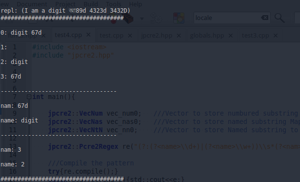
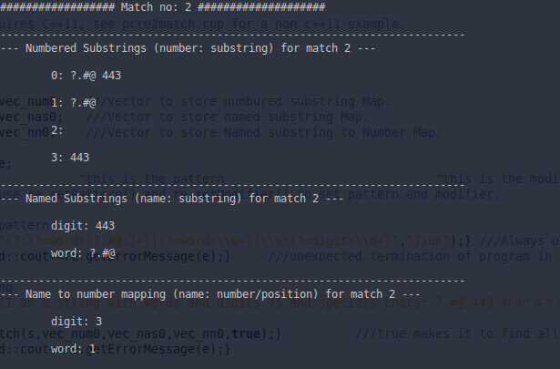
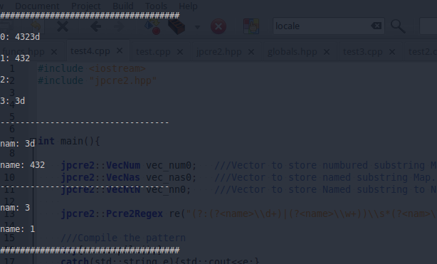
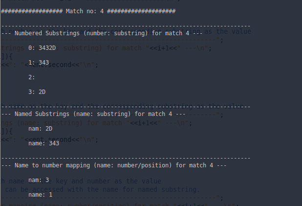

<div id="description"></div>
PCRE2 is the name used for a revised API for the PCRE library, which is a set of functions, written in C, that implement regular expression pattern matching using the same syntax and semantics as Perl, with just a few differences. Some features that appeared in Python and the original PCRE before they appeared in Perl are also available using the Python syntax.

This provides some C++ wrapper functions to provide some useful utilities like regex match and regex replace.

<div id="requires"></div>
#Requirements:

1. pcre2 library (`version >=10.21`).
2. C++ compiler with C++11 support.

If the required `pcre2` version is not available in the official channel, download <a href="https://github.com/jpcre2">my fork of the library from here</a>, Or use <a href="https://github.com/jpcre2/pcre2">this repository</a> which will always be kept compatible with `jpcre2`.

<div id="how-to"></div>
#Install/Include:

It can be installed as a separate library or can be used directly in a project by including the appropriate sources:

1. **jpcre2.h**
2. **jpcre2.cpp**
3. **jpcre2_match.cpp**
4. **jpcre2_replace.cpp**

An example compile/build command with GCC would be:

```sh
g++ mycpp.cpp jpcre2_match.cpp jpcre2_replace.cpp jpcre2.cpp jpcre2.h -lpcre2-8
```

If your PCRE2 library is not in the standard library path, then add the path:

```sh
g++ -std=c++11 mycpp.cpp ... -L/path/to/your/pcre2/library -lpcre2-8
```

**Note that** it requires the PCRE2 library installed in your system. If it is not already installed and linked in your compiler, you will need to link it with appropriate path and options.

**Installing jpcre2 as a library:**

To install it in a Unix based system, run:
```sh
./configure
make
sudo make install
```
Now to use it:

1. `#include <jpcre2.h>` in your code.
2. Build/compile by linking with jpcre2 and PCRE2 library.

An example command for GCC would be:

```sh
g++  mycpp.cpp -ljpcre2-8 -lpcre2-8 #sequence is important
```

If you are in a non-Unix system (e.g Windows), build a library from the jpcre2 sources with your favourite IDE or use it as it is.

**Note:**

<ol>
<li>PCRE2_CODE_UNIT_WIDTH other than 8 is not supported in this version.
</li>
<li>To use the PCRE2 POSIX compatible library, add the `-lpcre2-posix` along with the others.
</ol>

#How to code with jpcre2:

<ol>
<li>
First create a <code>jpcre2::Regex</code> object. This object will hold the pattern, modifiers, compiled pattern, error and warning codes.
<pre class="highlight"><code class="highlight-source-c++ cpp">jpcre2::Regex re;   //Create object</code></pre>
Each object for each regex pattern.
</li>
<li>
Compile the pattern and catch any error exception:
<pre class="highlight"><code class="highlight-source-c++ cpp">
try{
    re.compile()            //Invoke the compile() function
      .pattern(pat)         //set various parameters
      .modifiers("JiuX")    //...
      .jpcre2Options(0)     //...
      .pcre2Options(0)      //...
      .execute();           //Finaly execute it.
    
    //Another way is to use constructor to initialize and compile at the same time:
    jpcre2::Regex re2("pattern2","mSi");  //S is an optimization mod.
}
catch(int e){
    /*Handle error*/
    std::cout&lt;&lt;re.getErrorMessage(e)&lt;&lt;std::endl;
}
</code></pre>
</li>
<li>
Now you can perform match or replace against the pattern. Use the <code>match()</code> member function to preform regex match and the <code>replace()</code> member function to perform regex replace.
</li>
  <ol>
<li>
<b>Match:</b> The <code>match()</code> member function can take an optional argument (subject) and returns an object of the class <i>RegexMatch</i> which then in turn can be used to pass various parameters using  available member functions (method chaining) of <i>RegexMatch</i> class. The end function in the method chain should always be the <code>execute()</code> function which returns the result (number of matches found).
</li>
    <ul>
<li>
Perform match and catch any error exception:
<pre class="highlight"><code class="highlight-source-c++ cpp">
jpcre2::VecNum vec_num;
try{
    size_t count=re.match(subject)                            //Invoke the match() function
                   .modifiers(ac_mod)                         //Set various options
                   .numberedSubstringVector(vec_num)          //...
                   .jpcre2Options(jpcre2::VALIDATE_MODIFIER)  //...
                   .execute();                                //Finally execute it.
    //vec_num will be populated with maps of numbered substrings.
    //count is the total number of matches found
}
catch(int e){
    /*Handle error*/
    std::cout&lt;&lt;re.getErrorMessage(e)&lt;&lt;std::endl;
}
</code></pre>
Access the substrings like this:
<pre class="highlight"><code class="highlight-source-c++ cpp">
for(size_t i=0;i&lt;vec_num.size();i++){
    //This loop will iterate only once if find_all is false.
    //i=0 is the first match found, i=1 is the second and so forth
    for(auto const&amp; ent : vec_num[i]){
        //ent.first is the number/position of substring found
        //ent.second is the substring itself
        //when ent.first is 0, ent.second is the total match.
        //for(auto const&amp; ent : vec_num[i]):C++11 feature
        //If you want &lt;C++11 method, see pcre2match.cpp.
    }
}
</code></pre>
</li>
<li>
To get named substrings or name to number mapping, simply pass the appropriate vectors with <code>numberedSubstringVector()</code> and/or <code>namedSubstringVector()</code> and/or <code>nameToNumberMapVector()</code>:
<pre class="highlight"><code class="highlight-source-c++ cpp">
jpcre2::VecNum vec_num;   ///Vector to store numbured substring Map.
jpcre2::VecNas vec_nas;   ///Vector to store named substring Map.
jpcre2::VecNtN vec_ntn;    ///Vector to store Named substring to Number Map.
std::string ac_mod="g"; // g is for global match. Equivalent to using findAll() or FIND_ALL in jpcre2Options()
try{
    re.match(subject)                            //Invoke the match() function
      .modifiers(ac_mod)                         //Set various options
      .numberedSubstringVector(vec_num)          //...
      .namedSubstringVector(vec_nas)             //...
      .nameToNumberMapVector(vec_ntn)            //...
      .jpcre2Options(jpcre2::VALIDATE_MODIFIER)  //...
      .pcre2Options(PCRE2_ANCHORED)              //...
      .execute();                                //Finally execute it.
}
catch(int e){
    /*Handle error*/
    std::cout&lt;&lt;re.getErrorMessage(e)&lt;&lt;std::endl;
}
</code></pre>
And access the substrings by looping through the vectors and associated maps. The size of all three vectors are the same and can be accessed in the same way.
</li>
    </ul>
<li>
<b>Replace:</b> The <code>replace()</code> member function can take upto two optional arguments (subject and replacement string) and returns an object of the class <i>RegexReplace</i> which then in turn can be used to pass various parameters using  available member functions (method chaining) of <i>RegexReplace</i> class. The end function in the method chain should always be the <code>execute()</code> function which returns the result (replaced string).
</li>
    <ul>
<li>
Perform replace and catch any error exception:
<pre class="highlight prettyprint"><code class="highlight-source-c++ cpp">
try{
    std::cout&lt;&lt;
    re.replace()        //Invoke the replace() function
      .subject(s)       //Set various parameters
      .replaceWith(s2)  //...
      .modifiers("gE")  //...
      .jpcre2Options(0) //...
      .pcre2Options(0)  //...
      .execute();       //Finally execute it.
    //gE is the modifier passed (global and unknown-unset-empty).
    //Access substrings/captured groups with ${1234},$1234 (for numbered substrings)
    // or ${name} (for named substrings) in the replacement part i.e in replaceWith()
}
catch(int e){
    /*Handle error*/
    std::cout&lt;&lt;re.getErrorMessage(e)&lt;&lt;std::endl;
}

</code></pre>
</li>
<li>
If you pass the size of the resultant string with <code>bufferSize()</code> function, then make sure it will be enough to store the whole resultant replaced string, otherwise the internal replace function (<code>pcre2_substitute()</code>) will be called <i>twice</i> to adjust the size of the buffer to hold the whole resultant string in order to avoid <code>PCRE2_ERROR_NOMEMORY</code> error.
</li>
    </ul>
  </ol>
</ol>

#Insight:

Let's take a quick look what's inside and how things are working here:

###Namespaces:

1. **jpcre2_utils :** Some utility functions used by `jpcre2`.
2. **jpcre2 :** This is the namespace you will be using in your code to access `jpcre2` classes and functions.

###Classes:

1. **Regex :** This is the main class which holds the key utilities of `jpcre2`. Every regex needs an object of this class.
2. **RegexMatch:** This is the class that holds all the useful functions to perform regex match according to the compiled pattern.
3. **RegexReplace:** This is the class that holds all the useful functions to perform replacement according to the compiled pattern.

###Functions at a glance:

```cpp
//Class Regex

std::string getModifier()
std::string getPattern()
std::string getLocale()                ///Gets LC_CTYPE
uint32_t getCompileOpts()              ///returns the compile opts used for compilation

///Error handling
std::string getErrorMessage(int err_num)
std::string getErrorMessage()
std::string getWarningMessage()
int getErrorNumber()
int getErrorCode()
PCRE2_SIZE getErrorOffset()

Regex&              compile(const String& re,const String& mod)
Regex&              compile(const String& re="")
Regex&              pattern(const String& re)
Regex&              modifiers(const String& x)
Regex&              locale(const String& x)
Regex&              jpcre2Options(uint32_t x)
Regex&              pcre2Options(uint32_t x)
void                execute()  //executes the compile operation.

RegexMatch&         match()
RegexReplace&       replace()

//Class RegexMatch

RegexMatch&         numberedSubstringVector(VecNum& vec_num)
RegexMatch&         namedSubstringVector(VecNas& vec_nas)
RegexMatch&         nameToNumberMapVector(VecNtN& vec_ntn)
RegexMatch&         subject(const String& s)
RegexMatch&         modifiers(const String& s)
RegexMatch&         jpcre2Options(uint32_t x=NONE)
RegexMatch&         pcre2Options(uint32_t x=NONE)
RegexMatch&         findAll()
size_t              execute()  //executes the match operation


//Class RegexReplace

RegexReplace&       subject(const String& s)
RegexReplace&       replaceWith(const String& s)
RegexReplace&       modifiers(const String& s)
RegexReplace&       jpcre2Options(uint32_t x=NONE)
RegexReplace&       pcre2Options(uint32_t x=NONE)
RegexReplace&       bufferSize(PCRE2_SIZE x)
std::string         execute() //executes the replacement operation

```

<div id="modifiers"></div>
###Modifiers:

jpcre2 uses modifiers to control various options, type, behavior of the regex and its' interactions with different functions that uses it. Two types of modifiers are available: **compile modifiers** and **action modifiers**:

<div id="compile-modifiers"></div>

1. **Compile modifiers:** Modifiers that are used to compile a regex. They define the behavior of a regex pattern. The modifiers have more or less the same meaning as the [PHP regex modifiers](http://php.net/manual/en/reference.pcre.pattern.modifiers.php) except for `e, j and n` (marked with <sup>*</sup>). The available compile modifiers are:
  * **e** : Unset back-references in the pattern will match to empty strings. Equivalent to *PCRE2_MATCH_UNSET_BACKREF*.
  * **i** : Case-insensitive. Equivalent to *PCRE2_CASELESS* option.
  * **j**<sup>\*</sup> : `\u \U \x` and unset back-referencees will act as JavaScript standard.
     * `\U` matches an upper case "U" character (by default it causes a compile time error if this option is not set).
     * `\u` matches a lower case "u" character unless it is followed by four hexadecimal digits, in which case the hexadecimal number defines the code point to match (by default it causes a compile time error if this option is not set).
     * `\x` matches a lower case "x" character unless it is followed by two hexadecimal digits, in which case the hexadecimal number defines the code point to match (By default, as in Perl, a hexadecimal number is always expected after `\x`, but it may have zero, one, or two digits (so, for example, `\xz` matches a binary zero character followed by z) ).
     * Unset back-references in the pattern will match to empty strings.
  * **m** : Multi-line regex. Equivalent to *PCRE2_MULTILINE* option.
  * **n** : Enable Unicode support for `\w \d` etc... in pattern. Equivalent to *PCRE2_UTF | PCRE2_UCP*.
  * **s** : If this modifier is set, a dot meta-character in the pattern matches all characters, including newlines. Equivalent to *PCRE2_DOTALL* option.
  * **u** : Enable UTF support.Treat pattern and subjects as UTF strings. It is equivalent to *PCRE2_UTF* option.
  * **x** : Whitespace data characters in the pattern are totally ignored except when escaped or inside a character class, enables commentary in pattern. Equivalent to *PCRE2_EXTENDED* option.
  * **A** : Match only at the first position. It is equivalent to *PCRE2_ANCHORED* option.
  * **D** : A dollar meta-character in the pattern matches only at the end of the subject string. Without this modifier, a dollar also matches immediately before the final character if it is a newline (but not before any other newlines). This modifier is ignored if *m* modifier is set. Equivalent to *PCRE2_DOLLAR_ENDONLY* option.
  * **J** : Allow duplicate names for subpatterns. Equivalent to *PCRE2_DUPNAMES* option.
  * **S** : When a pattern is going to be used several times, it is worth spending more time analyzing it in order to speed up the time taken for matching/replacing. It may also be beneficial for a very long subject string or pattern. Equivalent to an extra compilation with JIT_COMPILER with the option *PCRE2_JIT_COMPLETE*.
  * **U** : This modifier inverts the "greediness" of the quantifiers so that they are not greedy by default, but become greedy if followed by `?`. Equivalent to *PCRE2_UNGREEDY* option.

<div id="action-modifiers"></div>

2. **Action modifiers:** Modifiers that are used per action i.e match or replace. These modifiers are not compiled in the regex itself, rather it is used per call of each function. Available action modifiers are:
  * **A** : Match at start. Equivalent to *PCRE2_ANCHORED*. Can be used in match operation. Setting this option only at match time (i.e regex was not compiled with this option) will disable optimization during match time.
  * **e** : Replaces unset group with empty string. Equivalent to *PCRE2_SUBSTITUTE_UNSET_EMPTY*. Can be used in replace operation.
  * **E** : Extension of *e* modifier. Sets even unknown groups to empty string. Equivalent to *PCRE2_SUBSTITUTE_UNSET_EMPTY | PCRE2_SUBSTITUTE_UNKNOWN_UNSET*.
  * **g** : Global. Will perform global matching or replacement if passed.
  * **x** : Extended replacement operation. It enables some Bash like features:
     1. `${<n>:-<string>}`
     2. `${<n>:+<string1>:<string2>}`

  `<n>` may be a group number or a name. The first form specifies a default value. If group `<n>` is set, its value is inserted; if not, `<string>` is expanded and the result is inserted. The second form specifies strings that are expanded and inserted when group `<n>` is set or unset, respectively. The first form is just a convenient shorthand for `${<n>:+${<n>}:<string>}`.

<div id="jpcre2-options"></div>

###jpcre2 options:

These options are meaningful only for the jpcre2 library itself not the original PCRE2 library. We use the `jpcre2Options()` function to pass these options.

1. **jpcre2::NONE**: This is the default option. Equivalent to 0 (zero).
2. **jpcre2::VALIDATE_MODIFIER**: If this option is passed, modifiers will be subject to validation check. If any of them is invalid then a `jpcre2::ERROR::INVALID_MODIFIER` error exception will be thrown. You can get the error message by `getErrorMessage(error_code)` member function.
3. **jpcre2::FIND_ALL**: This option will do a global matching if passed during matching. The same can be achieved by passing the 'g' modifier with `modifiers()` function.

###PCRE2 options:

While having its own way of doing things, jpcre2 also supports the traditional PCRE2 options to be passed. We use the `pcre2Options()` function to pass the PCRE2 options. These options are the same as the PCRE2 library and have the same meaning. For example instead of passing the 'g' modifier to the replacement operation we can also pass its PCRE2 equivalent *PCRE2_SUBSTITUTE_GLOBAL* to have the same effect.

#Testing:

2. **test_match.cpp**: Contains an example code for match function.
3. **test_replace.cpp**: Contains an example code for replace function.
4. **test_match2.cpp**: Another matching example. The makefile creates a binary of this (jpcre2match).
5. **test_replace2.cpp**: Another replacement example. The makefile creates a binary of this (jpcre2replace).

#Screenshots of some test outputs:

test_match:
----------






