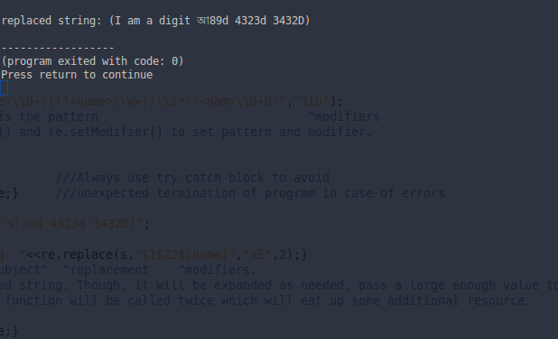

#C++ wrapper for several utilities of PCRE2 Library

PCRE2 is the name used for a revised API for the PCRE library, which is a set of functions, written in C, that implement regular expression pattern matching using the same syntax and semantics as Perl, with just a few differences. Some features that appeared in Python and the original PCRE before they appeared in Perl are also available using the Python syntax.

This provides some C++ wrapper functions to provide some useful utilities like regex match and regex replace.

#Requirements:

1. C++ compiler with C++11 support.
2. pcre2 library (`version >=10.21`).

If the required `pcre2` version is not available in the official channel, download <a href="https://github.com/jpcre2">my fork of the library from here</a>, Or use <a href="https://github.com/jpcre2/pcre2">this repository</a> which will always be kept compatible with `jpcre2`.

#How To:

Knowing how to use it in your C++ code and finally compile it comprises the basic knowledge of `jpcre2`.

##How to compile:

1. `#include` the `jpcre2.hpp` file in your program. 

2. Compile with `pcre2` library linked and c++11 enabled.

**Example:**

A simple *mycpp.cpp* file should be compiled with the following command with GCC.

```sh
g++ -std=c++11 mycpp.cpp -lpcre2-8
```

`-lpcre1-8` should be changed to the actual library i.e for 16 bit code unit: `-lpcre2-16` and for 32 bit code unit: `-lpcre2-32`.

If your `pcre2` library is not in the standard library path, then add the path:

```sh
g++ -std=c++11 mycpp.cpp -L/path/to/your/pcre2/library -lpcre2-8
```

**Note that** it requires the `pcre2` library installed in your system. If it is not already installed and linked in your compiler, you will need to link it with appropriate path and options.

##How to code:

<ol>
<li>
First create a <code>Pcre2Regex</code> object. This object will hold the pattern, modifiers, compiled pattern, error and warning codes.
</li>
  <ol>
<li>Each object for each regex pattern.
</li>
<li>Pattern and modifier can be initialized with constructor (<code>Pcre2Regex(pattern,modifier)</code>) or with member functions <code>setPattern()</code> and <code>setModifier()</code>.
Ex:<pre class="highlight"><code class="highlight-source-c++ cpp">
Pcre2Regex re("\\d\\w+","Sugi");   //Initialize pattern and modifier with constructor
re.setPattern("\\w\\S+");          //This sets the pattern
re.setModifier("g");               //This sets the modifier.
</code></pre>
</li>
<li>
N.B: Every time you change the pattern, you will need to recompile it and every time you change compile modifier, you will need to recompile the pattern to apply the change.
</li>
  </ol>
<li>
Compile the pattern and catch any errors:
<pre class="highlight"><code class="highlight-source-c++ cpp">
try{re.compile();}                          //This compiles the previously set pattern and modifier
catch(int e){/*Handle error*//*std::cout&lt;&lt;re.getErrorMessage(e)&lt;&lt;std::endl;*/}
try{re.compile("pattern","mgi");}           //This compiles the pattern and modifier provided.
catch(int e){/*Handle error*//*std::cout&lt;&lt;re.getErrorMessage(e)&lt;&lt;std::endl;*/}
</code></pre>
</li>
<li>
Now you can perform match or replace against the pattern. Use the <code>match()</code> member function to preform regex match and the <code>replace()</code> member function to perform regex replace.
</li>
  <ol>
<li>
<b>Match:</b> The <code>match()</code> member function takes the subject string and some specialized vectors (vectors of maps of substrings) as its arguments and a last argument to tell whether to match all or only the first. It puts the results in the maps of the vectors and returns true on successful match and false otherwise.
</li>
    <ul>
<li>
<pre><code>
re.match("I am a subject string",vec_num);
//vec_num will be populated with numbered substrings.
</code></pre>
Access the substrings like this:
<pre class="highlight"><code class="highlight-source-c++ cpp">
for(int i=0;i&lt;(int)vec_num.size();i++){
    //This loop will iterate only once if find_all is false.
    //i=0 is the first match found, i=2 is the second and so forth
    for(auto const&amp; ent : vec_num[i]){
    //ent.first is the number/position of substring found
    //ent.second is the substring itself
    //when ent.first is 0, ent.second is the total match.
    }
}
</code></pre>
</li>
<li>
Other variations of this function can be used to get named substrings and the position of named substrings. Simply pass the appropriate vectors in the match function:
<pre><code>
re.match("I am a subject string",vec_num,vec_nas,vec_nn);
</code></pre>
And access the substrings by looping through the vectors and associated maps. The size of all three vectors are the same and they can be passed in any sequence (i.e the order of the vectors as arguments is not important).
</li>
    </ul>
<li>
<b>Replace:</b> The <code>replace()</code> member function takes the subject string as first argument and replacement string as the second argument and two optional arguments (modifier and the size of the resultant string) and returns the resultant string after performing the replacement operation. If no modifier is passed an empty modifier is assumed.
</li>
    <ul>
<li>
<pre class="highlight prettyprint"><code class="highlight-source-c++ cpp">
re.replace("replace this string according to the pattern","with this string","mgi");
//mgi is the modifier passed (multiline, global, case insensitive).
//Access substrings/captured groups with ${1234},$1234 (for numbered substrings) or ${name} (for named substrings)
</code></pre>
</li>
<li>
If you pass the size of the resultant string with the replace function, then make sure it will be enough to store the whole resultant replaced string, otherwise the internal replace function (<code>pcre2_substitute()</code>) will be called <i>twice</i> to adjust the size to hold the whole resultant string in order to avoid <code>PCRE2_ERROR_NOMEMORY</code> error. Two consecutive call of the same function may affect overall performance of your code.
</li>
    </ul>
  </ol>
</ol>

#Insight:

##Namespaces:

1. **jpcre2_utils :** Some utility functions used by `jpcre2`.
2. **jpcre2 :** This is the namespace you will be using in your code to access `jpcre2` classes and functions.

##Classes:

1. **Pcre2Regex :** This is the main class which holds the key utilities of `jpcre2`. Every regex needs an object of this class.

##Functions:

```cpp

Pcre2Regex(){pat_str="";modifier="";mylocale=DEFAULT_LOCALE;}
Pcre2Regex(const std::string& re,const std::string& mod="",const std::string& loc=DEFAULT_LOCALE)
{pat_str=re;modifier=mod;mylocale=loc;}

~Pcre2Regex(){free();}

void parseReplacementOpts(const std::string& mod);
void parseCompileOpts(const std::string& mod);
void parseOpts(const std::string& mod){parseReplacementOpts(mod);parseCompileOpts(mod);}

std::string getModifier(){return modifier;}
void setModifier(const std::string& mod){modifier=mod;}

std::string getPattern(){return pat_str;}
void setPattern(const std::string& pat){pat_str=pat;}

void setLocale(const std::string& loc){mylocale=loc;}   ///Sets LC_CTYPE
std::string getLocale(){return mylocale;}               ///Gets LC_CTYPE

pcre2_code* getPcreCode(){return code;}                 ///returns address to compiled regex
void free(void){pcre2_code_free(code);}                 ///frees memory used for the compiled regex.

///Compiles the regex.
///If pattern or modifier or both not passed, they will be defaulted to previously set value.
void compile(void){compile(pat_str,modifier,mylocale);}
void compile(const std::string& re,const std::string& mod,const std::string& loc=DEFAULT_LOCALE);
void compile(const std::string& re){compile(re,modifier,mylocale);}

///returns a replaced string after performing regex replace
///If modifier is not passed it will be defaulted to empty string
std::string replace( std::string mains, std::string repl,const std::string& mod="",PCRE2_SIZE out_size=REGEX_STRING_MAX);
std::string replace( std::string mains, std::string repl,size_t out_size){return replace(mains,repl,"",out_size);}

///returns true for successful match, stores the match results in the specified vectors
bool match(const std::string& subject,VecNum& vec_num,VecNas& vec_nas,VecNtN& vec_nn,bool find_all=false);

///Other variants of match function
///3-vector variants
bool match(const std::string& subject,VecNum& vec_num,VecNtN& vec_nn,VecNas& vec_nas,bool find_all=false);
bool match(const std::string& subject,VecNas& vec_nas,VecNum& vec_num,VecNtN& vec_nn,bool find_all=false);
bool match(const std::string& subject,VecNas& vec_nas,VecNtN& vec_nn,VecNum& vec_num,bool find_all=false);
bool match(const std::string& subject,VecNtN& vec_nn,VecNas& vec_nas,VecNum& vec_num,bool find_all=false);
bool match(const std::string& subject,VecNtN& vec_nn,VecNum& vec_num,VecNas& vec_nas,bool find_all=false);

///2-vector variants
bool match(const std::string& subject,VecNum& vec_num,VecNas& vec_nas,bool find_all=false);
bool match(const std::string& subject,VecNas& vec_nas,VecNum& vec_num,bool find_all=false);
bool match(const std::string& subject,VecNum& vec_num,VecNtN& vec_nn,bool find_all=false);
bool match(const std::string& subject,VecNtN& vec_nn,VecNum& vec_num,bool find_all=false);
bool match(const std::string& subject,VecNas& vec_nas,VecNtN& vec_nn,bool find_all=false);
bool match(const std::string& subject,VecNtN& vec_nn,VecNas& vec_nas,bool find_all=false);

///1-vector variants
bool match(const std::string& subject,VecNum& vec_num,bool find_all=false);
bool match(const std::string& subject,VecNas& vec_nas,bool find_all=false);
bool match(const std::string& subject,VecNtN& vec_nn,bool find_all=false);

///Error handling
std::string getErrorMessage(int err_num);
std::string getErrorMessage();
std::string getWarningMessage(){return current_warning_msg;}
int getErrorNumber(){return error_number;}
int getErrorCode(){return error_code;}
PCRE2_SIZE getErrorOffset(){return error_offset;}
```


#Testing:

1. **test.cpp**: Contains an example code for match and replace function.
2. **test_match.cpp**: Contains an example code for match function.
3. **test_replace.cpp**: Contains an example code for replace function.

#Screenshots of some test outputs:

test_match:
----------


test_replace:
-------------



